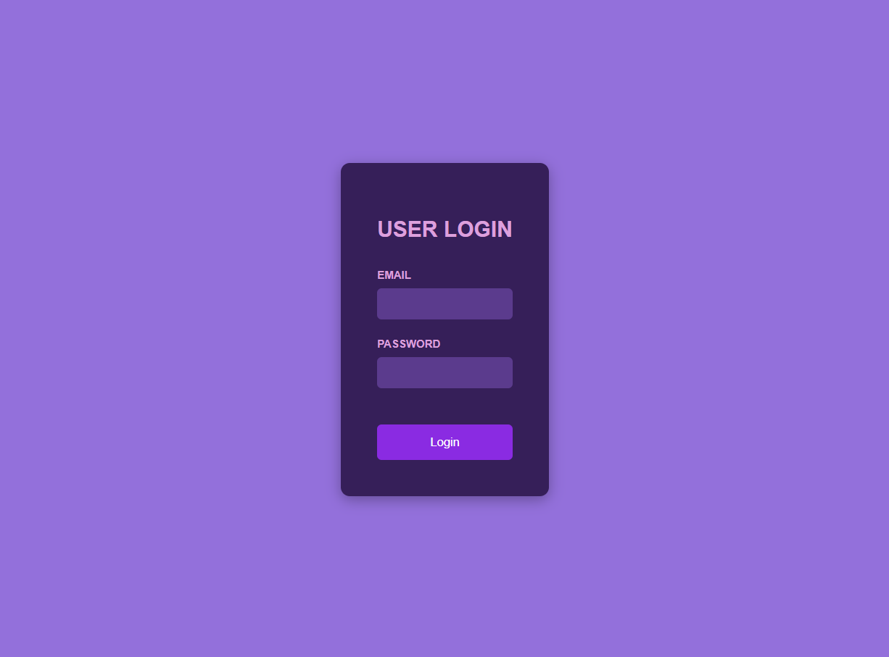
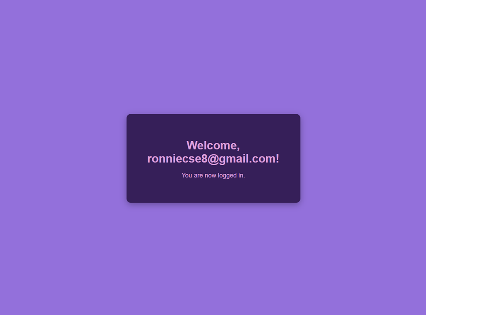

## User Login React Application
This document provides an overview and usage instructions for the User Login React application.

## Overview
This application demonstrates a simple user login flow using React. It features a login form where users can enter their email and password. Upon clicking the "Login" button, the application updates its internal state to reflect a logged-in user, using the actual values entered into the input fields. The UI then switches from the login form to a welcome message.

## Features
Login Form: A basic form with email and password input fields.

State Management: Uses React's useState hook to manage the login credentials (email, password) and the logged-in status.

Event Handling: The "Login" button triggers an event handler that updates the application's state.

Conditional Rendering: The application conditionally renders either the login form or a welcome message based on the loggedIn state.

Responsive Design: Styled with embedded CSS to provide a basic responsive layout suitable for different screen sizes.

## Project Structure (Conceptual)
Although the code is provided within a single self-contained immersive block, conceptually, a typical React project would organize these files as follows:

src/
├── components/
│   └── UserLogin.jsx   # Component for the login form UI
├── App.jsx             # Main application component, handles login logic and state
├── index.js            # Entry point for the React application
└── App.css             # Global styles for the application (in this case, embedded)

## Usage
To run this application, you would typically set up a React development environment. Since the code is provided in a single immersive block, you can paste the entire content into a App.jsx file (e.g., within a create-react-app project) and ensure your index.js renders the App component.

App.jsx (or App.js)
This file contains the main React component (App), which manages the login state and includes the UserLogin sub-component and all the necessary CSS directly embedded within a <style> tag.

How it Works
Input State: The App component uses useState hooks (inputEmail, inputPassword) to capture the values typed by the user in the email and password input fields.

UserLogin Component: This component receives the inputEmail, inputPassword values, and the setEmail, setPassword functions as props. It renders the input fields and updates the parent App component's state as the user types.

handleLogin Function: When the "Login" button is clicked, the handleLogin function is called. This function takes the current values from inputEmail and inputPassword states and uses them to update the user state (specifically, setting user.email, user.password, and user.loggedIn to true).

Conditional Rendering: The App component checks the user.loggedIn state. If true, it displays a welcome message; otherwise, it shows the UserLogin form.

Styling
All styling for this application is included directly within the style tag inside the App component. This approach is used for self-contained runnable examples in environments like this one. In a larger-scale React project, you would typically define these styles in separate .css files (e.g., App.css) and import them into your components for better organization and maintainability. The styles are designed to mimic the appearance shown in the provided screenshots.

📂 Project Structure
my-storybook-app/
├── src/
│   ├── App.jsx                       # Main application component
│   ├── index.js                      # Entry point for React app
│   ├── components/
│   │   ├── LoginHandler/
│   │   │   ├── LoginHandler.jsx       # Storyteller component logic
│   │   │   └── LoginHandler.module.css # Styles for Storyteller component
│   │   └── UserLogin/
│   │       ├── UserLogin.jsx           # Individual Chapter component logic
│   │       └── UserLogin.module.css    # Styles for Chapter component
│   └── styles/
│       └── global.css                # Global application styles

💻 Technologies Used
React: A JavaScript library for building user interfaces.

CSS Modules: For scoped component-level styling.

## 📸 Screenshots

## 🧑‍💻 Author
Shubham Sarkar
📧 Email: subhampandora123@gmail.com
🔗 LinkedIn: linkedin.com/in/shubham-sarkar-877841b2