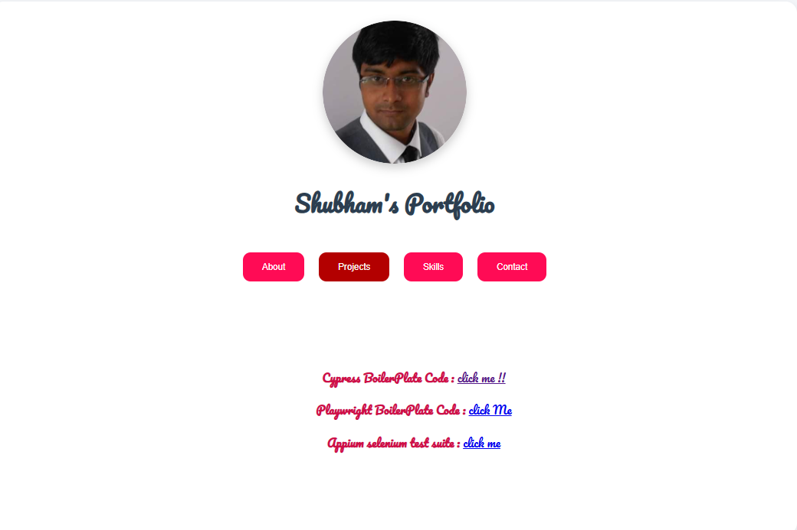

# 💼 Shubham's Portfolio

Welcome to my personal portfolio website built with React! This application showcases my skills, experience, and projects in a clean, interactive, and responsive design.


## 🧾 Features

- 📷 Profile image and intro
- 🧠 Tabbed navigation for different sections:
    - About
    - Projects
    - Skills
    - Contact
- 💌 Contact information with emojis
- 📱 Responsive and mobile-friendly layout
- 🎨 Styled with clean, modern CSS

---

## 🛠️ Tech Stack

- **Frontend:** React, JavaScript, HTML5, CSS3
- **Styling:** Custom CSS with Google Fonts
- **Tools:** WebStorm / VS Code, Node.js, npm

---

## 📁 Folder Structure

portfolio/
├── public/
│ └── index.html
├── src/
│ ├── components/
│ │ ├── About.js
│ │ ├── Projects.js
│ │ ├── Skills.js
│ │ └── Contact.js
│ ├── App.js
│ ├── index.js
│ └── styles.css
├── package.json
└── README.md

yaml
Copy
Edit

---

## 🧰 Getting Started

### Prerequisites

- Node.js (v18.x recommended)
- npm (comes with Node)

### Installation

1. Clone the repository:
   ```bash
   git clone https://github.com/your-username/portfolio.git
   cd portfolio
Install dependencies:

bash
Copy
Edit
npm install
Start the development server:

bash
Copy
Edit
npm start

## 📸 Screenshots 





## 🧑‍💻 Author
Shubham Sarkar
📧 Email: subhampandora123@gmail.com
🔗 LinkedIn: linkedin.com/in/shubham-sarkar-877841b2

