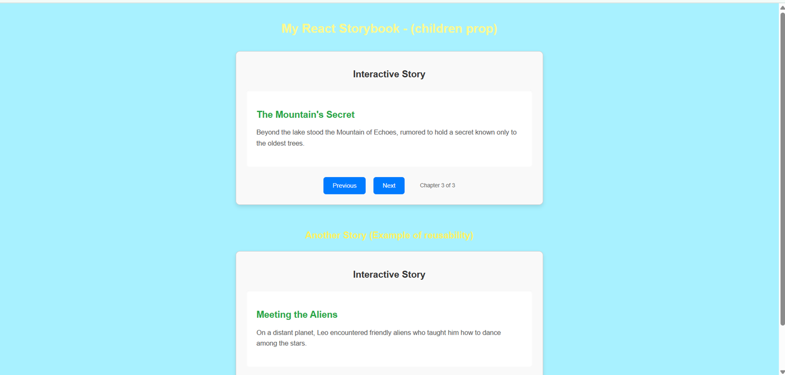

Interactive Storyteller React Application
This project demonstrates the use of the children prop in React to create a flexible and reusable interactive storyteller. It allows you to define individual story chapters as separate components and pass them as children to a central Storyteller component, which then manages navigation between them.

✨ Features
Chapter-based Storytelling: Easily define and organize your story into distinct chapters.

Navigation Controls: Simple "Previous" and "Next" buttons to move through chapters.

Reusable Component: The Storyteller component can be reused for multiple stories with different content.

Modular Design: Separation of concerns with dedicated components (Storyteller.jsx, Chapter.jsx) and CSS Modules for styling.

🚀 Getting Started
Follow these instructions to get a copy of the project up and running on your local machine.

Prerequisites
You need to have Node.js and npm (or yarn) installed on your system.

Node.js: Download & Install Node.js

npm: Comes bundled with Node.js.

yarn (Optional): npm install -g yarn

Installation
Clone the repository (or create a new React app and copy the files):

If starting from scratch with Create React App:

npx create-react-app my-storybook-app
cd my-storybook-app

Create the necessary file structure:

my-storybook-app/
├── public/
├── src/
│   ├── components/
│   │   ├── Storyteller/
│   │   ├── Chapter/
│   │   └── ...
│   ├── styles/
│   └── ...
├── package.json
└── ...

Copy the code:

Place the App.jsx content into src/App.jsx.

Place the Storyteller.jsx and Storyteller.module.css content into src/components/Storyteller/.

Place the Chapter.jsx and Chapter.module.css content into src/components/Chapter/.

Place the global.css content into src/styles/.

Install dependencies:

npm install
# or
yarn install

Run the application:

npm start
# or
yarn start

This will open the application in your default browser at http://localhost:3000.

📖 Usage
Once the application is running:

You will see an "Interactive Story" section with the first chapter displayed.

Use the "Next" button to advance to the subsequent chapter.

Use the "Previous" button to go back to the previous chapter.

The chapter information (e.g., "Chapter 1 of 3") will update accordingly.

Observe how the same Storyteller component is reused below for a different story.

📂 Project Structure
my-storybook-app/
├── src/
│   ├── App.jsx                       # Main application component
│   ├── index.js                      # Entry point for React app
│   ├── components/
│   │   ├── Storyteller/
│   │   │   ├── Storyteller.jsx       # Storyteller component logic
│   │   │   └── Storyteller.module.css # Styles for Storyteller component
│   │   └── Chapter/
│   │       ├── Chapter.jsx           # Individual Chapter component logic
│   │       └── Chapter.module.css    # Styles for Chapter component
│   └── styles/
│       └── global.css                # Global application styles
└── ...

💻 Technologies Used
React: A JavaScript library for building user interfaces.

CSS Modules: For scoped component-level styling.

## 📸 Screenshots

## 🧑‍💻 Author
Shubham Sarkar
📧 Email: subhampandora123@gmail.com
🔗 LinkedIn: linkedin.com/in/shubham-sarkar-877841b2