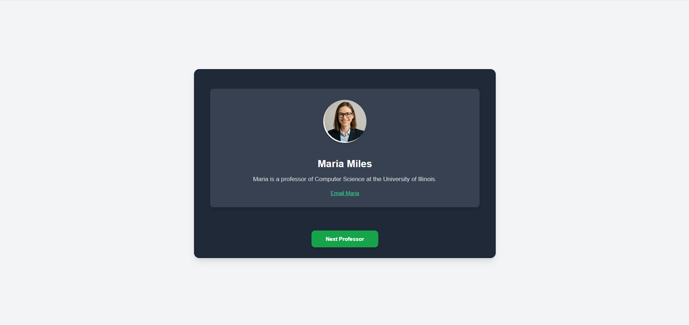
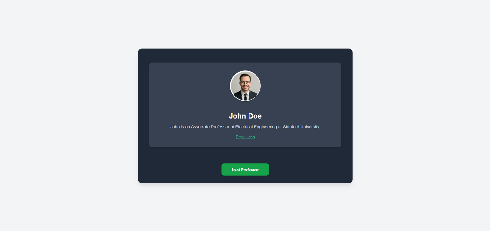

## ProfessorCard Component
This document provides an overview of the ProfessorCard React component.

## Overview
The ProfessorCard component is a reusable UI element designed to display the details of a single professor. It includes the professor's name, designation, a profile image, and an email link. It is styled using Tailwind CSS for a modern and responsive appearance.

Usage
To use the ProfessorCard component, simply import it into your React application and pass the professor data as a prop.

## Example
import React from 'react';
// Assuming ProfessorCard is in './components/ProfessorCard.jsx'
import ProfessorCard from './components/ProfessorCard';

const App = () => {
const maria = {
name: 'Maria Miles',
designation: 'Maria is a professor of Computer Science at the University of Illinois.',
email: 'maria.miles@example.com',
image: 'https://placehold.co/150x150/0F766E/FFFFFF?text=Maria+Miles'
};

return (

<ProfessorCard professor={maria} />

);
};

export default App;

Props
The ProfessorCard component accepts the following prop:

Prop Name

Type

Description

Required

professor

Object

An object containing the professor's details.

Yes

The professor object should have the following structure:

name (String): The full name of the professor.

designation (String): The professor's designation or a brief description of their role.

email (String): The professor's email address.

image (String): The URL of the professor's profile image. A fallback placeholder image will be used if the URL is invalid or the image fails to load.

Styling
This component is styled using Tailwind CSS. All styling is applied directly via Tailwind utility classes within the JSX. This approach provides a highly customizable and responsive design without the need for separate .css files for component-specific styles.

If you are integrating this component into a project that does not already use Tailwind CSS, you will need to set up Tailwind in your project for the styles to render correctly.

## 📂 Project Structure
my-storybook-app/
├── src/
│   ├── App.jsx                       # Main application component
│   ├── index.js                      # Entry point for React app
│   ├── components/
│   │   ├── professorShowcase/
│   │   │   ├── professorShowcase.jsx       # professorShowcase component logic
│   │   │   └── professorShowcase.module.css # Styles for professorShowcase component
│   │   └── profressorCard/
│   │       ├── profressorCard.jsx           # profressorCard component logic
│   │       └── profressorCard.module.css    # Styles for profressorCard component # Global application styles
└── ...

💻 Technologies Used
React: A JavaScript library for building user interfaces.

CSS Modules: For scoped component-level styling.

## 📸 Screenshots

## 🧑‍💻 Author
Shubham Sarkar
📧 Email: subhampandora123@gmail.com
🔗 LinkedIn: linkedin.com/in/shubham-sarkar-877841b2